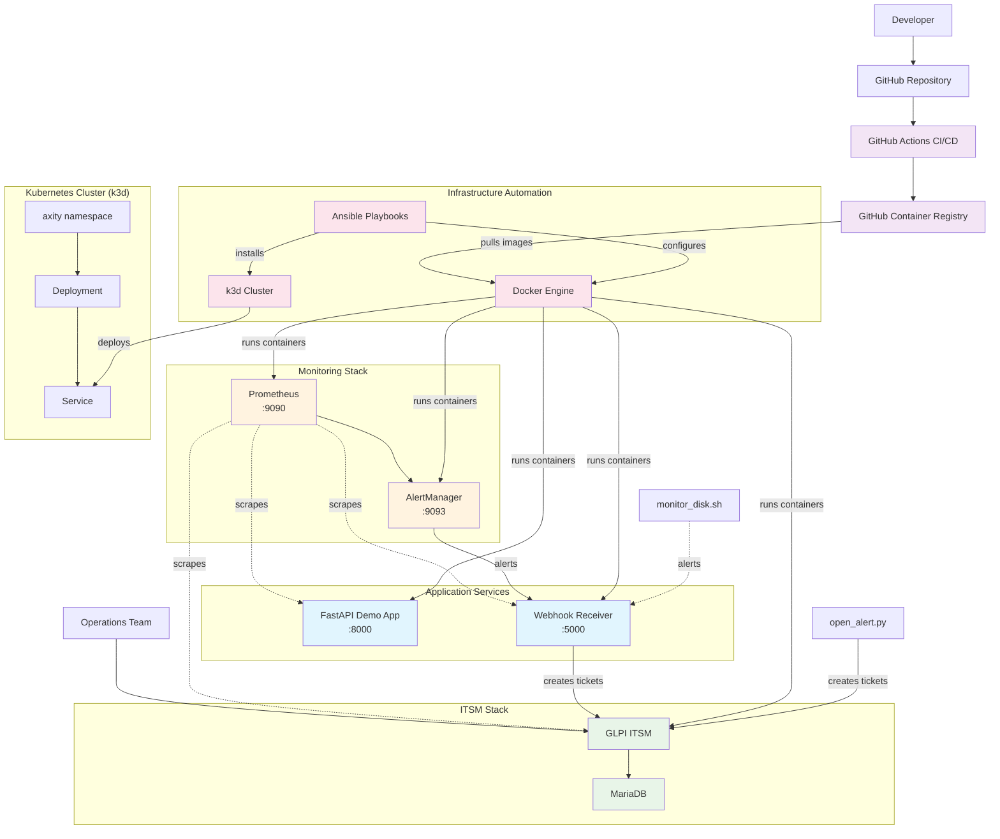

# Axity Infra Ops Lab - Architecture Diagram

## System Architecture Overview

## Component Descriptions

### Application Layer
- **FastAPI Demo App**: Simple REST API with health checks and metrics endpoints
- **Webhook Receiver**: Processes Prometheus alerts and creates GLPI tickets

### Monitoring Stack
- **Prometheus**: Metrics collection and alerting rules
- **AlertManager**: Alert routing and notification management

### ITSM (IT Service Management)
- **GLPI**: Open-source ITSM solution for ticket management
- **MariaDB**: Database backend for GLPI

### Infrastructure Automation
- **Ansible**: Configuration management and system setup
- **Docker**: Container runtime and orchestration
- **k3d**: Lightweight Kubernetes for local development

### CI/CD Pipeline
- **GitHub Actions**: Automated testing, building, and deployment
- **GitHub Container Registry**: Docker image storage

## Data Flow

### Normal Operations
1. Applications expose metrics endpoints
2. Prometheus scrapes metrics every 15 seconds
3. Healthy applications respond successfully
4. Metrics are stored in Prometheus time-series database

### Alert Flow (when issues occur)
1. Application becomes unavailable or unhealthy
2. Prometheus detects the issue based on alert rules
3. AlertManager receives the alert from Prometheus
4. AlertManager routes the alert to the Webhook Receiver
5. Webhook Receiver processes the alert payload
6. Webhook Receiver creates a ticket in GLPI via REST API
7. Operations team receives notification in GLPI

### Deployment Flow
1. Developer pushes code to GitHub
2. GitHub Actions CI/CD pipeline triggers
3. Code is tested and validated
4. Docker images are built and pushed to GHCR
5. Images can be deployed to local or k3d environments

## Network Ports

| Service | Port | Protocol | Purpose |
|---------|------|----------|----------|
| FastAPI App | 8000 | HTTP | API endpoints and health checks |
| Webhook Receiver | 5000 | HTTP | Alert webhook and GLPI integration |
| Prometheus | 9090 | HTTP | Metrics collection and web UI |
| AlertManager | 9093 | HTTP | Alert management and web UI |
| GLPI | 8080 | HTTP | ITSM web interface |
| MariaDB | 3306 | TCP | Database connections |

## Security Considerations

- All services run in isolated containers
- GLPI uses database authentication
- Webhook receiver validates alert payloads
- GitHub Actions uses secure token authentication
- No services exposed directly to the internet in lab environment

## Scalability Notes

- Prometheus can be configured with multiple targets
- AlertManager supports clustering for high availability
- GLPI can handle multiple concurrent ticket creations
- k3d cluster can be scaled with additional nodes
- Webhook receiver processes alerts asynchronously